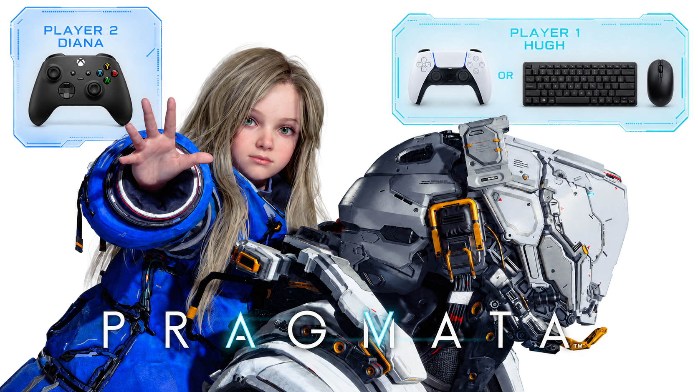
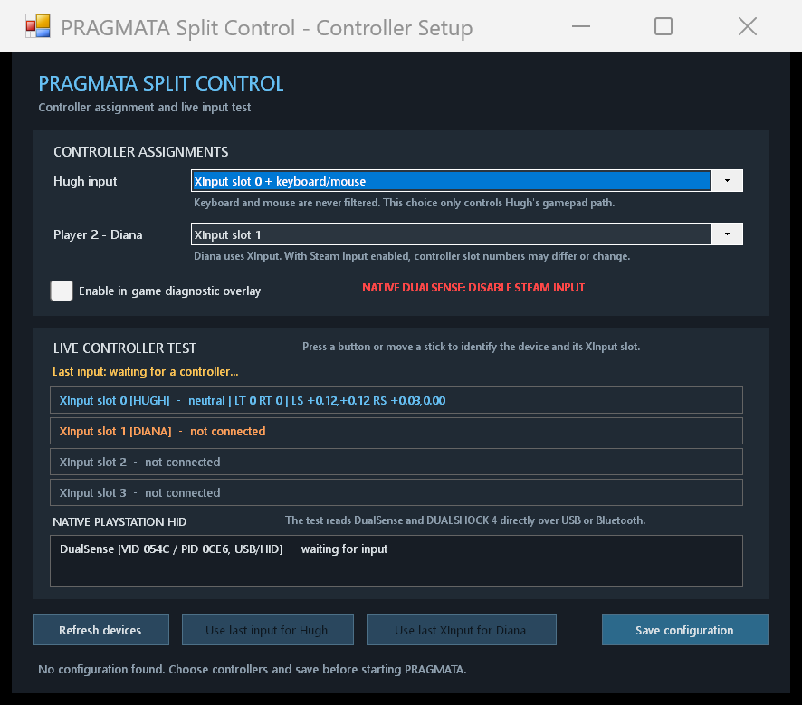

# PRAGMATA Split Control (Two-Player Co-op Mod)




*Read this in other languages: [Русский](README_RU.md)*

A local two-player co-op mod for **PRAGMATA** (Steam version 1.2.2.0+).

This mod enables local split-control co-op on a single PC:
- **Player 1 (Hugh)**: Full control over movement, combat, camera, and target selection.
- **Player 2 (Diana)**: Uses a second controller to solve hacking mini-games and puzzles (`Y/X/A/B` or `▲/■/X/●`).

---

## Architecture & How Input Isolation Works

RE Engine natively merges input from all connected controllers into a single combined device. To separate controls, this mod consists of three components:

1. **Native Input Filter (`native/PragmataInputFilter.cpp`)**:
   - Hooks `XINPUT1_4.dll` functions inside `PRAGMATA.exe`.
   - Isolates controllers so the game engine only sees Player 1's gamepad while Player 2's inputs are intercepted.
   - Keyboard and mouse input is never filtered and always remains available to Player 1.

2. **C# REFramework Plugin (`managed/PragmataSplitControl/`)**:
   - Reads Player 2's controller via `XINPUT9_1_0.dll`.
   - Passes Player 2's hacking directional commands directly into active in-game puzzles.
   - Automatically falls back control to Player 1 if Player 2's controller disconnects.

3. **Configurator Utility (`tools/PragmataSplitControlConfigurator.cs`)**:
   - WinForms application for easy controller slot assignment and live input testing.

---

## Supported Controller Setups

- **DualSense / DUALSHOCK 4 (Native HID) for P1 + Xbox/XInput for P2** (Recommended to retain DualSense adaptive triggers).
- **Two Xbox / XInput Controllers**.
- **Keyboard & Mouse for P1 + XInput Controller for P2**.

---

## Repository Structure

```
├── managed/               # C# plugin for REFramework
│   └── PragmataSplitControl/
│       ├── PragmataSplitControl.cs
│       ├── PragmataSplitControl.csproj
│       └── AssemblyInfo.cs
├── native/                # Native C++ input filter DLL
│   └── PragmataInputFilter.cpp
├── tools/                 # WinForms configurator tool source
│   └── PragmataSplitControlConfigurator.cs
├── release/               # Config templates and release assets
├── README.md              # English documentation
└── README_RU.md           # Russian documentation
```

---

## Requirements & Building

### Requirements:
- [REFramework](https://github.com/praydog/REFramework-nightly/releases) 

### Building:
1. **C# Plugin**: `dotnet build managed/PragmataSplitControl/PragmataSplitControl.csproj -c Release`
2. **Configurator**: Build `tools/PragmataSplitControlConfigurator.cs` into `PragmataSplitControl_Config.exe`
3. **C++ Filter**: Build `native/PragmataInputFilter.cpp` into `PragmataSplitControl_InputFilter.dll` (x64 DLL)

---

## Installation & Usage

1. Install REFramework.
2. Extract the compiled mod files into your `PRAGMATA.exe` game directory.
3. Run `PragmataSplitControl_Config.exe`, assign controllers, and click **Save configuration**.
4. Launch PRAGMATA.
